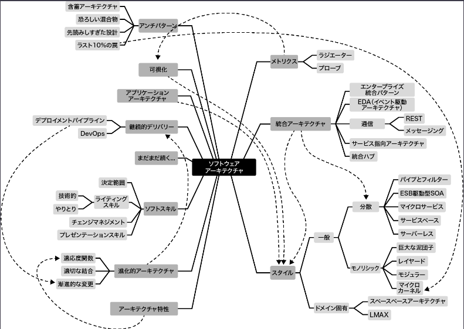

- サンプルコード：<https://fundamentalsofsoftwarearchitecture.com/>

- 「ソフトウェアアーキテクト」：世界中で最高の職業リストの上位にランクインしている
- が、明確なキャリアパスがないのはなぜか？
  - ソフトウェアアーキテクチャ自体の定義が業界でよく定まっていないこと

- アーキテクチャを定義したくない
  - アーキテクチャとは（それが何であれ）重要なものだ

- ソフトウェアアーキテクチャに関する多くの書籍は、一度解決すればその後は安心して無視できる性的な問題として扱っている
- しかし、本書では定義そのものを含めて動的な性質を持つものとして扱う

